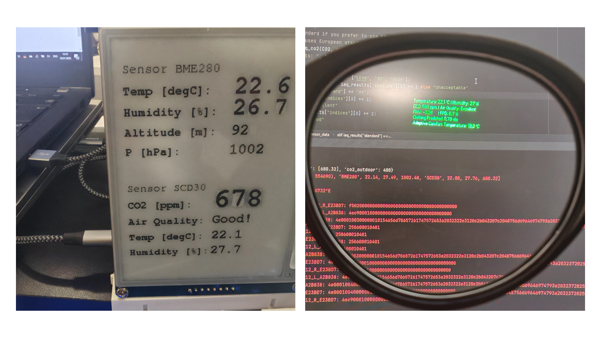
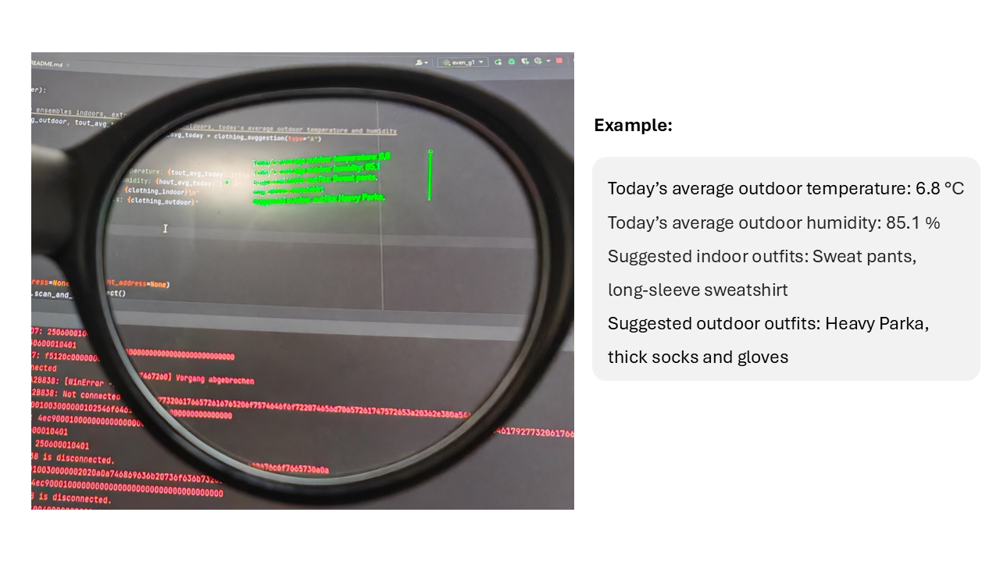
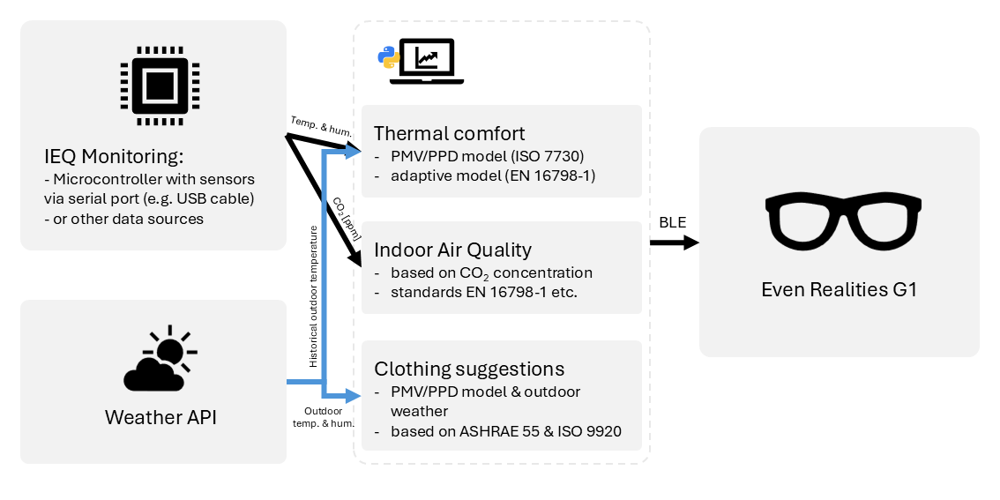

# EvenComfort

Experimental script to display Indoor Environmental Quality sensor data on Even Realities G1 glasses.

## Usage

1. Configure the microcontroller (serial port / baud rate / sensors) in `even_g1.py`

    - You can find the demo Arduino code and the quick build guides [here](./microcontroller): 
    - If you only need the clothing suggestion based on thermal comfort model, you can skip this step

2. Configure `latitude`, `longitude` and `timezone` in `get_weather.py`

3. Run `even_g1.py`

    - If you don't have sensor data, you could still use daily clothing suggestion function, see line 152-153.

## Features

- Connect microcontroller via serial port

- Send sensor data to even-realities g1 smart glasses

    - Supports Bosch BME280 for air temperature, relative humidity, air pressure

    - Supports Sensirion SCD30 for CO2 concentration in ppm (it also has temperature and humidity data, but not recommended due to accuracy)

- Indoor Environmental Quality evaluation

    - Thermal comfort evaluation based on Fanger's PMV/PPD model (ISO 7730) & adaptive model (EN 16798-1:2019)

    - Indoor air quality based on CO2 concentration indoors and different standards & laws

- **NEW: Daily clothing suggestions based on ASHRAE 55 & ISO 9920**

    - No microcontroller or sensor data required, only needs weather API

- TODO: Add support for other IEQ domains like noise, lighting, VOC-based IAQ etc.

## Showcase

Sending sensor data to G1

Giving clothing suggestions indoors / outdoors

## How it works

You can use other data sources such as smart home systems and modify the `get_data` method in `serial_reader`. Just convert the data format to match the example given in the comments.

If you are curious about the principles behind these models, I have previously written an wiki article about the basis of IEQ, which you can read [here](https://rw.e3d.rwth-aachen.de/en/wiki/about-the-basis-of-ieq-2/) (I know it may be a bit long).

## License

This project is licensed under the GNU General Public License v3.0 as it depends on [even_glasses](https://github.com/emingenc/even_glasses) (Thanks to @emingenc for the Python API).

If you only copy my part, you can consider it as MIT license.

## Expand the G1 open source ecosystem!

Technically, the microcontroller ESP32 I use also supports BLE connection, which can send sensor data directly to the glasses without needing a computer to run the script. But since my monitoring device on my desk is next to my laptop and will not be moved, I have not implemented this yet (too lazy :D).

Feel free to copy my code into your applications! Further development plans are to support some other devices I previously developed about Indoor Environmental Quality (they have more types of sensors, such as noise, light, VOC, etc.).

I'm not a full-time professional software developer, so please don't judge my shitty code. I also have no experience in developing Android or iOS apps :(

If you have other ideas, feel free to submit an issue labelled `enhancement`.

### Some cool repos for Even Realities G1 I found earlier:

- [EvenDemoApp](https://github.com/even-realities/EvenDemoApp): The official demo app from Even Realities.

- [@emingenc: even_glasses](https://github.com/emingenc/even_glasses): Very complete and powerful Python API.

- [@meyskens: fahrplan](https://github.com/meyskens/fahrplan): Integration for real time train info!

- [@emingenc: Emotional AI Voice Chat](https://github.com/emingenc/G1_voice_ai_assistant): Fast conversation with emotional AI with even-realities G1 smart glass connection.

- [@emingenc: g1_flutter_blue_plus](https://github.com/emingenc/g1_flutter_blue_plus): Another repo from @emingenc for Dart implementation.

- [@NyasakiAT: G1-Navigate](https://github.com/NyasakiAT/G1-Navigate): Further development of the Dart implementation and BMP composing code
