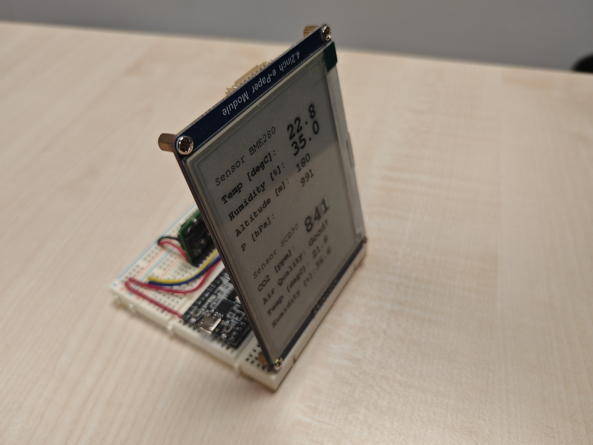
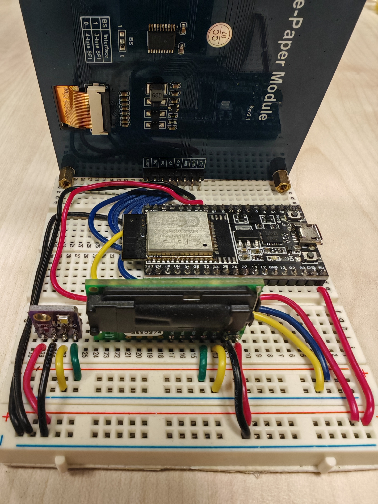

# Hardware

Here are some simple prototypes I have previously built for monitoring Indoor Environmental Quality.

## CO2 box with E-Ink display (vertical)

- Microcontroller: Espressif ESP-32 DevKitC (WROOM-32D/E) (10~15€)

- Sensors:

    - Bosch BME280 development board (5V version) for air temperature [°C] / relative humidity [%] / air pressure [hPa] (5~10€)

    - Sensirion SCD30 development board for CO2 concentration [ppm] / air temperature [°C] (not recommended*) / humidity [%] (not recommended*) (20~50€)

- E-Ink display: Waveshare 4.2inch E-Ink display module (400x300) (20~40€)

### Wiring

1. Connect BME280 to the microcontroller e.g. using jumper wires:
    
    - VIN - 5V

    - GND - GND

    - SCL - GPIO 22

    - SDA - GPIO 21

2. Connect SCD30 to the microcontroller:

    - VIN - 5V

    - GND - GND

    - SCL - GPIO 22

    - SDA - GPIO 21

3. Connect Waveshare E-Ink display to the microcontroller:

    - VCC - 5V

    - GND - GND

    - DIN - GPIO 23

    - CLK - GPIO 18

    - CS - GPIO 5

    - DC - GPIO 17

    - RST - GPIO 16

    - BUSY - GPIO 4

### Calibration

If you have a reference device for calibration, you could apply [One Point Offset Calibration](https://learn.adafruit.com/calibrating-sensors/single-point-calibration) and adjust the offsets in:

- line 27: `float bme_temp_adjt = -1.1;` for temperature (BME280),

- line 29: `float bme_hum_adjt = 0;` for humidity (BME280),

- line 31: `float bme_altitude_adjt = 0;` for altitude (calculated),

- line 33: `float bme_pressure_adjt = 0;` for air pressure (BME280),

- line 36: `float scd30_temp_adjt = -3.1;` for temperature (SCD30),

- line 38: `float scd30_hum_adjt = 0;` for humidity (SCD30),

- line 40: `float scd30_co2_adjt = 0;` for CO2 (SCD30), actually you don't need to calibrate the CO2 since the SCD30 is in ASC (automatic self-calibration) mode, more details please see: [Field calibration for SCD30](https://sensirion.com/media/documents/33C09C07/620638B8/Sensirion_SCD30_Field_Calibration.pdf).

## CO2 box without display

- Microcontroller: Espressif ESP-32 DevKitC (WROOM-32D/E) (10~15€)

- Sensors:

    - Bosch BME280 development board (5V version) for air temperature [°C] / relative humidity [%] / air pressure [hPa] (5~10€)

    - Sensirion SCD30 development board for CO2 concentration [ppm] / air temperature [°C] (not recommended*) / humidity [%] (not recommended*) (20~50€)

### Wiring

1. Connect BME280 to the microcontroller e.g. using jumper wires:
    
    - VIN - 5V

    - GND - GND

    - SCL - GPIO 22

    - SDA - GPIO 21

2. Connect SCD30 to the microcontroller e.g. using jumper wires:

    - VIN - 5V

    - GND - GND

    - SCL - GPIO 22

    - SDA - GPIO 21

### Calibration

See `CO2 box with E-Ink display (vertical)`

# Quick Build Guide

1. Finish `Wiring` described above.

2. Download the open-source Arduino IDE and install ESP32 boards following e.g. this tutorial: [Installing the ESP32 Board in Arduino IDE (Windows, Mac OS X, Linux)](https://randomnerdtutorials.com/installing-the-esp32-board-in-arduino-ide-windows-instructions/)

3. Install sensor libraries: [Tutorial](https://docs.arduino.cc/software/ide-v1/tutorials/installing-libraries/)

    - Please see the `requirements.txt` in the Arduino code folder for the required libraries.

4. Configure upload settings:

    - Board: ESP32 Arduino - ESP32 Dev Module

    - Upload Speed: It doesn't matter. If you have problems uploading, try selecting a slower speed like 115200.

    - Port: COMxx (you can find out the COM port of your ESP32 in the device manager, or just plug in and unplug to see which COM port appears).

    - You can leave the other settings blank (using defaults).

5. Upload the code & **Press the `Boot` button on the ESP32 until the sketch has been fully uploaded**: [Tutorial](https://support.arduino.cc/hc/en-us/articles/4733418441116-Upload-a-sketch-in-Arduino-IDE)

# Reference

## CO2 box with E-Ink display (vertical)

# Notes

You can buy the hardware listed above from any platform such as Amazon, AliExpress... The prices in the list are for reference only.

[*] The temperature and humidity data from the SCD30 is used for internal compensation of the CO2 measurement. As the SCD30 itself generates heat, it is not recommended for use if you need more accurate data.